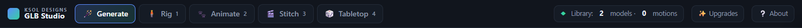
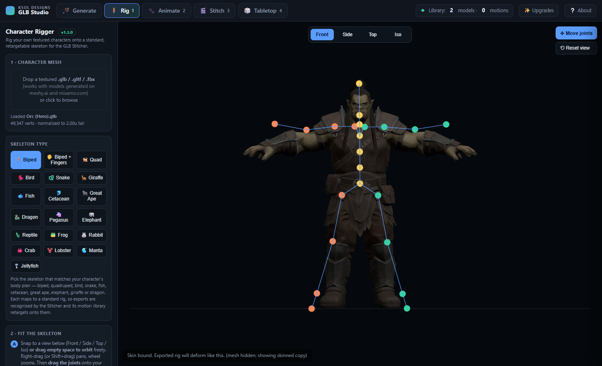
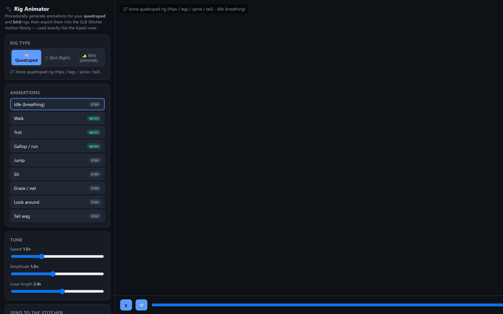
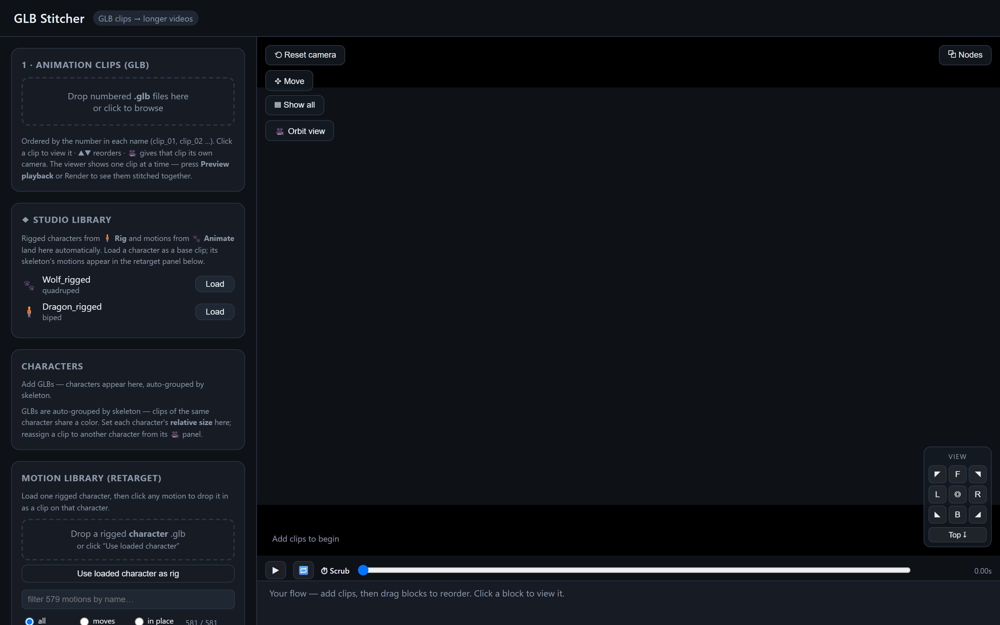

# KSOL Designs GLB Studio

[](https://potassiumsolutions.github.io/glb-studio/)
[](https://github.com/Potassiumsolutions/glb-studio/stargazers)
[](https://github.com/Potassiumsolutions/glb-studio/commits/main)
[](https://hits.sh/github.com/Potassiumsolutions/glb-studio/)
[](LICENSE)

**Turn an AI-generated 3D character into a finished animated video — free, in your browser, on your own machine.**

A small suite of three tools that share one library, so a character you rig or a
motion you make is instantly usable by the next step:

### 🧍 Rig → 🐾 Animate → 🎬 Stitch



- **🧍 Rig** — drop a textured `.glb` character; it **auto-fits a skeleton** (biped / quadruped / bird) and **auto-skins** it. Nudge the joints if you want, then export a rigged GLB.
- **🐾 Animate** — procedurally generate **biped, quadruped & bird** motions, organized by category (walking, running, jumping, climbing, boxing, fencing, football, dancing…), tuned by speed / amplitude / loop length.
- **🎬 Stitch** — load a rigged character, **auto-retarget** motions onto it, and composite clips into one **MP4** with 3D scenes, camera moves, multiple characters, audio and cross-fades.

Everything runs **client-side** — nothing is uploaded, no account, no cloud.

---

## ▶ Try it

**Live:** **https://potassiumsolutions.github.io/glb-studio/**

**Or run it locally** (needs a tiny static server so the tools share one origin):

```bash
# from the project folder — any static server works:
python -m http.server 8770       # then open http://localhost:8770/studio/
# or:  npx serve -l 8770
```

On Windows you can just double-click **`run-local.bat`** (needs [Python](https://python.org)).
Chrome or Edge recommended. Internet is needed the *first* time only, to load the 3D engine.

---

## What each tool does

**Rig** — auto-fit + auto-skin onto a standard, retargetable skeleton (biped 24-bone, quadruped 27-bone, bird 35-bone), with optional manual joint refinement and a live weight preview. Exports a rigged `.glb`.

**Animate** — procedural motion generator for quadrupeds and birds on the same skeletons, with a live proxy preview. Motions you bake join the Stitcher's retarget list automatically.

**Stitch** — the hub:
- Auto-retargets any motion onto any rigged character (bone-match + proportion + rest-pose compensation).
- **Scenes:** 3D rooms and open-expanse environments with colour-matched photo texture sets, props, terrain relief, and travel / camera-follow.
- **Ensemble:** multiple characters on one stage at once.
- **Timeline & node editor**, per-clip cameras, cross-fades, audio, and exact-length **MP4** export (WebCodecs H.264) — or bake the whole sequence to a single GLB.

The **Studio** shell ties them together with a menu and a shared in-browser library, plus an **❔ About** walkthrough. See [`studio/README.md`](studio/README.md) for details.





---

## A note on the motion library

This edition ships with an **original biped motion library** — **150 actions across 15
categories** (Walking, Running, Jumping, Climbing, Boxing, Fencing, Football,
Track & Field, Combat, Sports, Dancing, Household, Work, Emotes, and everyday Gestures) —
all **procedurally generated with the 🐾 Animate tool in this suite**, so they're free to
distribute. Load a rigged biped character in **🎬 Stitch** and they auto-retarget onto it.

You can grow the library at any time: make more motions in **🐾 Animate** (biped,
quadruped or bird), or drop in your own animated `.glb` clips — rigged characters
auto-retarget whatever you add.

---

## Sample characters

No rigged character yet? The [`samples/`](samples/) folder has four ready to try — a
**human** (biped), a **dog** (quadruped), and two **bird** poses (**perched** / **in flight**).
Drag any of them onto the character drop area in **🎬 Stitch** and the matching motions retarget onto them.
Or rig your own textured model in **🧍 Rig** — it works the same way. See
[`samples/README.txt`](samples/README.txt).

---

## Tech

- Pure client-side HTML/JS. [three.js](https://threejs.org) + [mp4-muxer](https://github.com/Vanilagy/mp4-muxer) loaded from a CDN; everything else is local.
- No build step, no backend, no telemetry. Your files never leave your device.
- Works as a set of static files — host it anywhere (GitHub Pages, any static host) or run it locally.

## Credits

Made by **KSOL Designs** — **Paul A.T. Ramey**, CAD Artist / Designer / Maker.

- 🌐 [ksoldesigns.com](https://www.ksoldesigns.com)
- ✉️ [Paul@ksoldesigns.com](mailto:Paul@ksoldesigns.com)
- ♥ [Patreon](https://www.patreon.com/KsolDesigns)

If this is useful to you, a Patreon follow or a ⭐ on the repo is appreciated.

## License

[MIT](LICENSE) © 2026 Paul A.T. Ramey / **KSOL Designs**. Free to use, modify, and share.
